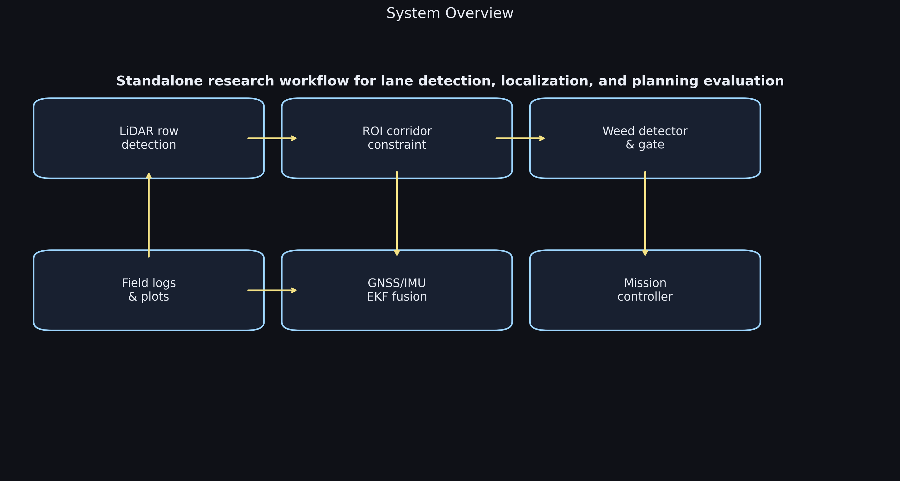
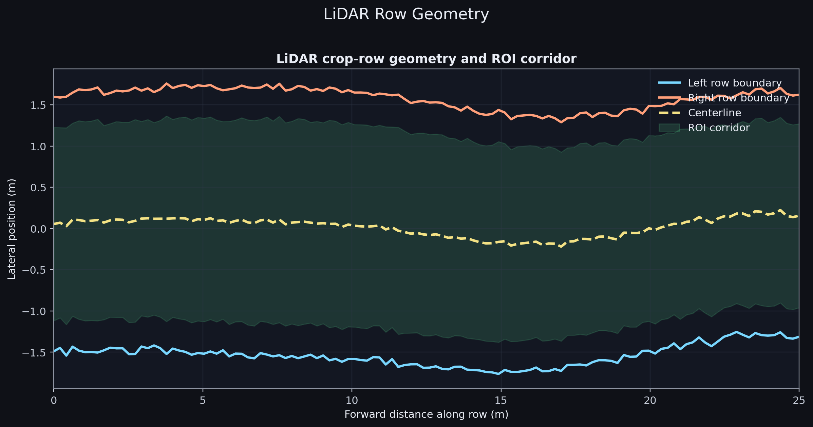
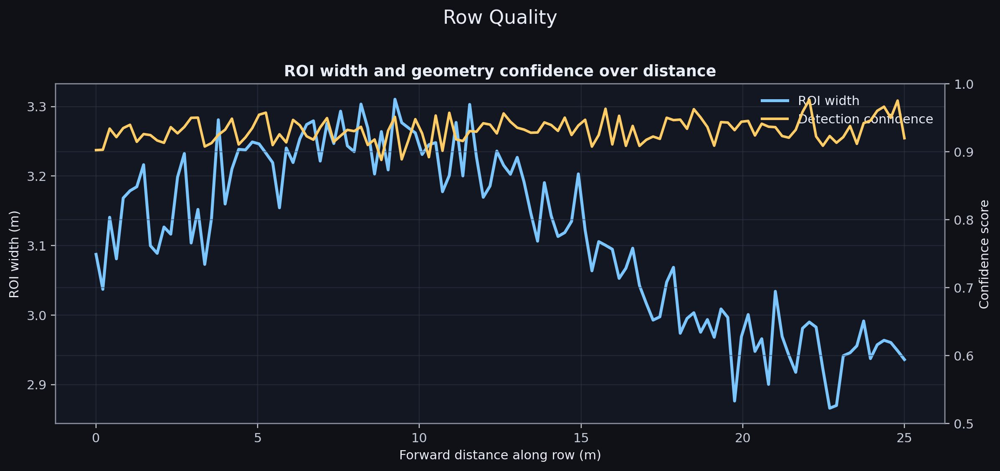
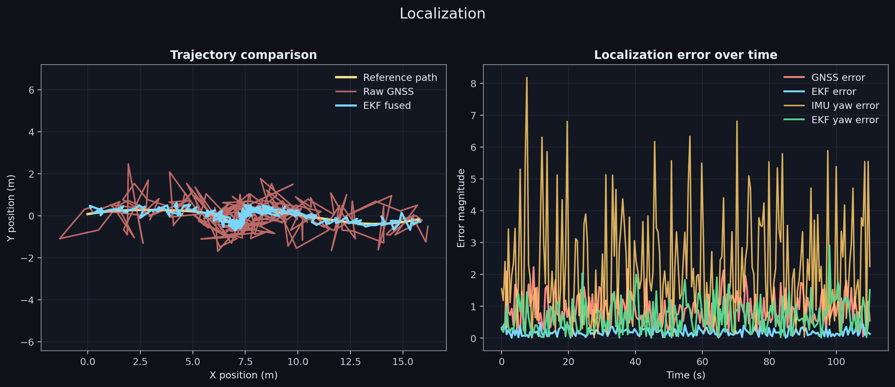
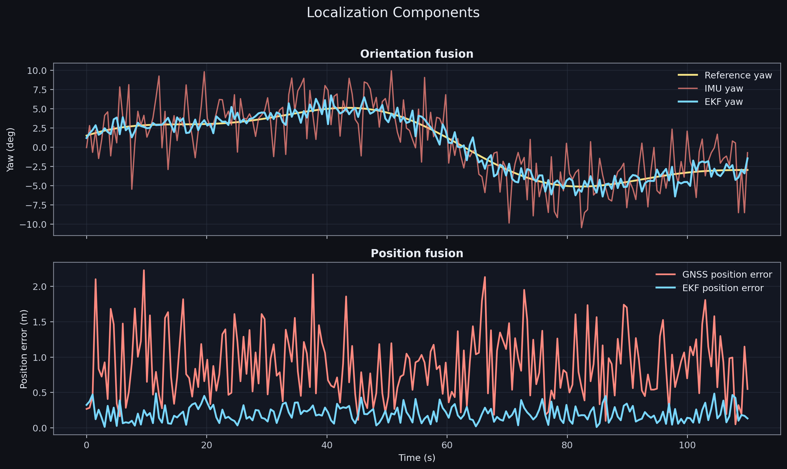
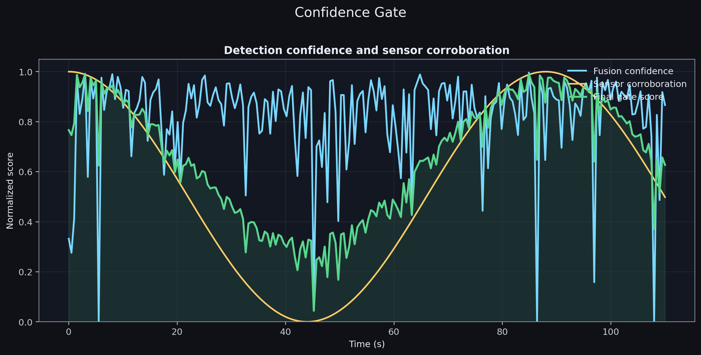
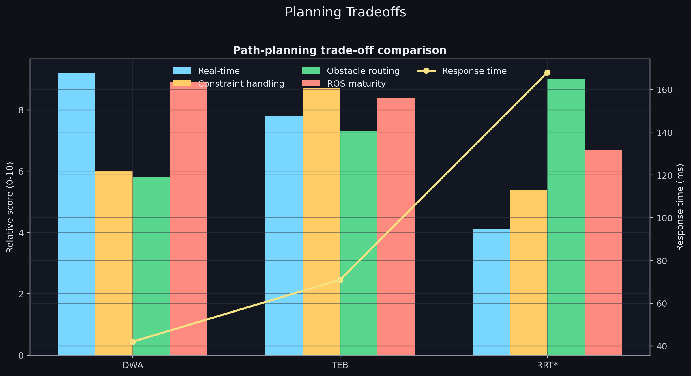
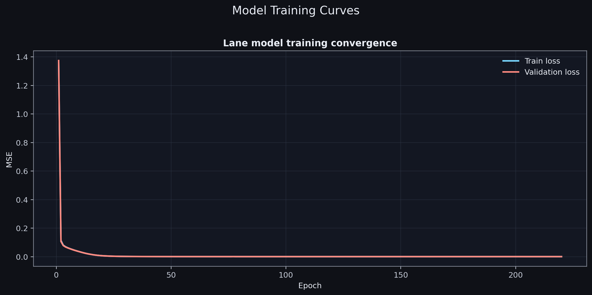
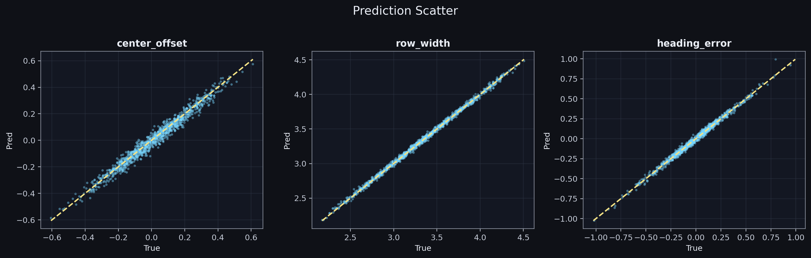
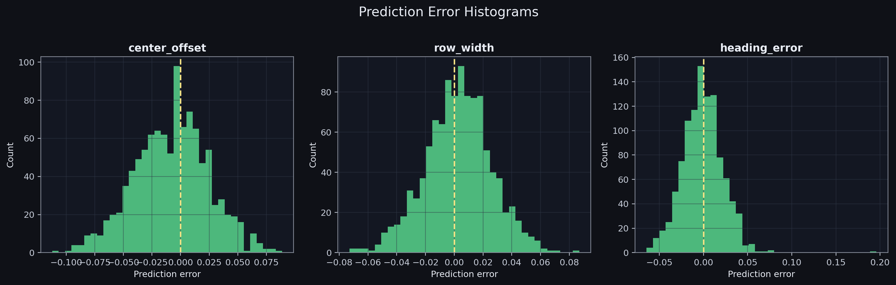

# Lane Detection Research: Visual Walkthrough

This file lays out every generated visual and explains the full workflow from architecture to model outcomes.

## System Overview



- Shows the full flow: row geometry, ROI constraints, localization fusion, control linkage, and reporting.
- Clarifies where each module output is consumed downstream.

## Row Geometry



- Left and right row boundaries are estimated over distance.
- The centerline is derived between boundaries.
- The ROI corridor narrows where valid object reasoning should happen.

## Row Quality



- Corridor width trend plus confidence trend.
- Useful for detecting unstable sections and deciding when to reduce trust in lane-derived constraints.

## Localization (Trajectory + Error)



- Compares reference path, raw GNSS, and EKF-fused trajectory.
- Also shows time-domain error behavior.

## Localization Components



- Yaw channels: reference, IMU, EKF.
- Position error channels through time.

## Confidence Gate



- Fusion confidence, sensor corroboration, and final gate score.
- Demonstrates reliability behavior for action gating.

## Planning Tradeoffs



- Scores DWA/TEB/RRT* across criteria with response-time overlay.
- Supports algorithm selection by operational priorities.

## Model Training Curves



- Train and validation MSE across 220 epochs.
- Curves show stable convergence.

## Prediction Scatter



- Predicted vs true targets for `center_offset`, `row_width`, `heading_error`.
- Tight clustering around diagonal indicates strong fit quality.

## Error Histograms



- Residual distributions by target.
- Errors are centered near zero with compact spread.

## Numeric Results

From `research_outputs/lane_model_metrics.json`:

- Epochs: 220
- Batch size: 128
- Learning rate: 0.001
- Final train loss: 0.0006362268121135623
- Final validation loss: 0.0006918320170321405
- RMSE: [0.033117371510736744, 0.0230790294177393, 0.022816200357534525]
- MAE: [0.02619709880970442, 0.018209553582679314, 0.01762138660545253]
- R2: [0.9709056347419874, 0.9977182991101659, 0.9907976196816148]

## Regenerate Everything

```bash
python -m research.run_research --output-dir research_outputs --seed 21
```
