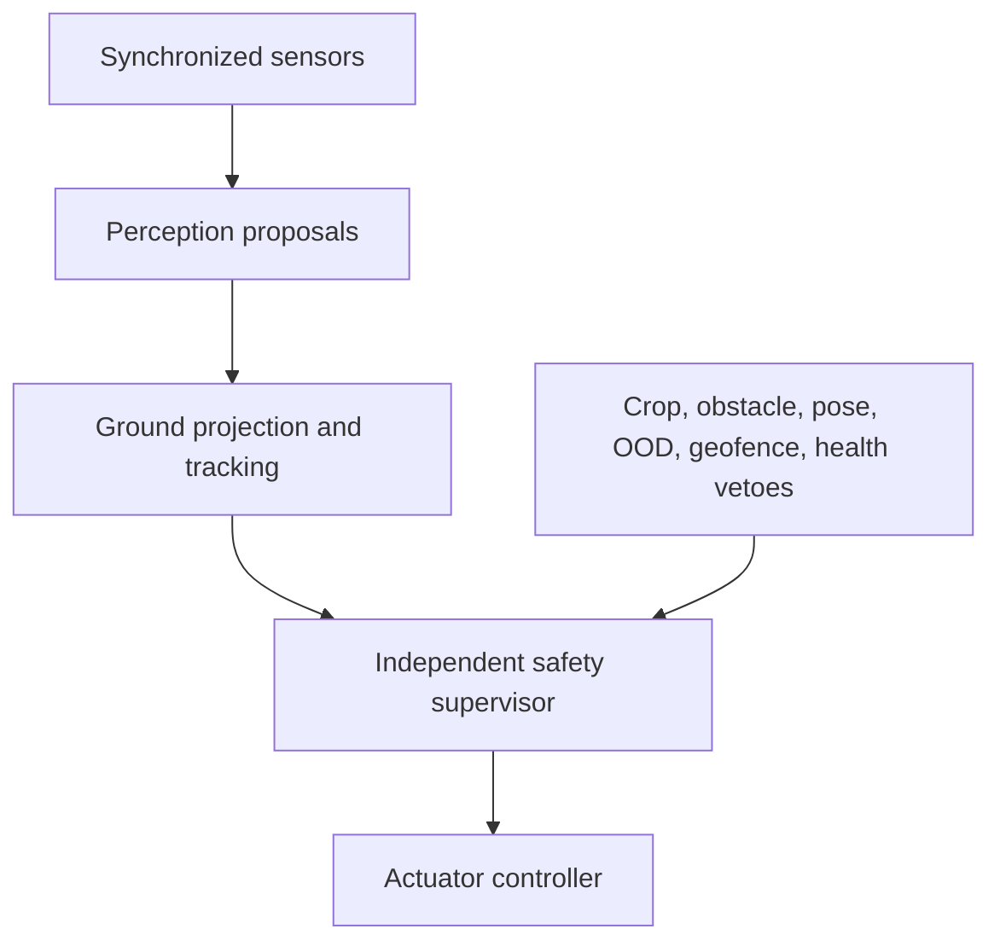
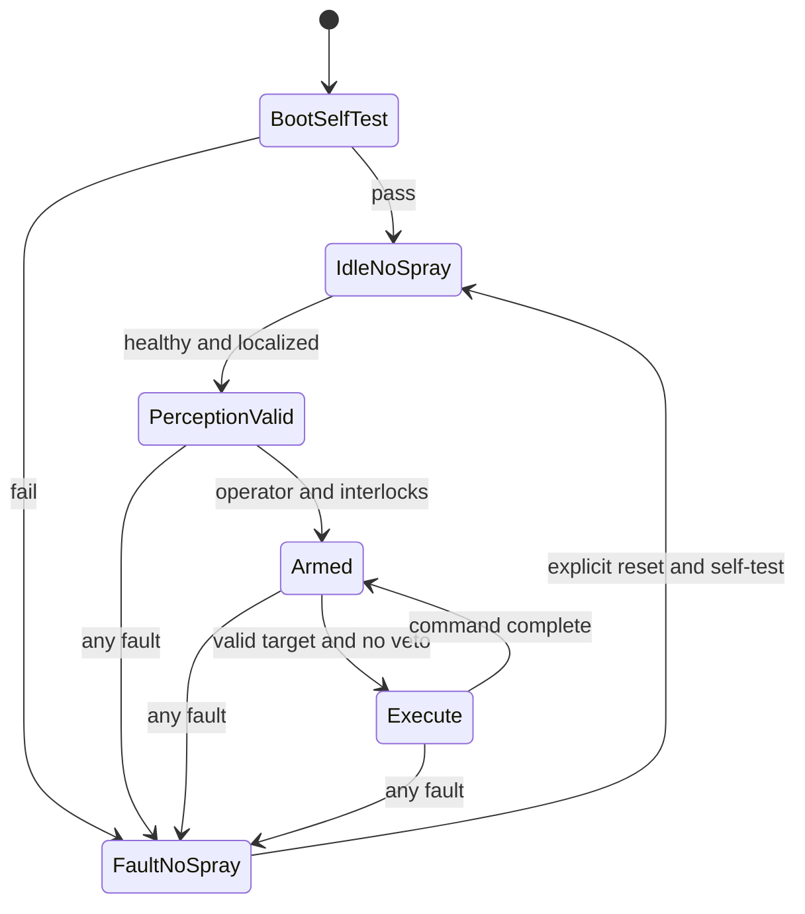

# AgriNav Ground-Up Deployment Roadmap

**Prepared:** 2026-07-20  
**Basis:** full repository audit, supplied WeedDet T7d run/checkpoint, supplied RiceSEG pretraining archive/notebook, supplied detector dataset, and current primary/official technical resources  
**Intended outcome:** move AgriNav from a research snapshot with invalid evaluation and unsafe inference semantics to (1) a reproducible perception research project, then (2) a supervised water-only field prototype, and only later (3) a reviewed selective-treatment system.

---

## 1. The short answer: the ten things to fix first

Do these in this order. Do **not** spend more GPU time tuning the current T7 pipeline before items 1–6 are complete.

| Priority | Fix | Why it is blocking | Proof that it is fixed |
|---|---|---|---|
| 1 | Disable every spray-by-default path | The current inference treats everything not detected as rice as a spray target. A missed rice detection therefore becomes permission to spray. | Every missing, uncertain, stale, or invalid input returns `spray_allowed = false`; fault-injection tests pass. |
| 2 | Define the real deployment boundary | The repository is a perception research project, not a complete navigation/sprayer system. Target crop, growth stage, field, speed, camera, compute, nozzle, chemical, operator, and weather limits are not defined. | A versioned operating-domain and system-requirements document is approved before model selection. |
| 3 | Retire and rebuild the detector split | About 56% of all detector images belong to obvious capture families represented across train/validation/test; 54.5% of validation and 53.0% of test images are in families also present in train. The current test is not independent. | A source/session/site-grouped manifest has zero group overlap and a sealed test release. |
| 4 | Change the labeling task from “rice versus complement” to affirmative treatment evidence | All 1,347 current images contain rice; only 132 contain weeds and only 358 weed boxes exist. Boxes around rice cannot define safe sprayable ground. | A written ontology, verified negative scenes, affirmative weed/treatment masks, rice-protection masks, and annotation QA report exist. |
| 5 | Fix geometric and target-assignment correctness | The exact T7d source has a PIL-affine translation direction error; the image and boxes move oppositely. ATSS candidate selection and forced-positive collisions also have correctness risks. | Synthetic geometry, assignment-invariant, encode/decode, and tiny-overfit tests all pass. |
| 6 | Replace the notebook as the source of truth | Mutable Colab paths, unpinned installs, mixed evaluator settings, incomplete checkpoints, and notebook-only logic prevent reproducibility. | A package/CLI/config pipeline runs from a clean environment; notebooks only analyze saved outputs. |
| 7 | Establish maintained reference baselines | Without RetinaNet/FCOS/Mask R-CNN or RT-DETR-style references, it is impossible to know whether custom WeedDet problems come from data, transforms, loss, assignment, or architecture. | Baselines are trained under the same split and budget, with standard metrics and 3–5 seeds. |
| 8 | Rerun the RiceSEG transfer study as a controlled factorial experiment | The existing “RiceSEG” path is actually ImageNet → RiceSEG → frozen WeedDet, so it does not isolate RiceSEG. The country holdout parser is also broken. | Scratch, ImageNet, random → RiceSEG, and ImageNet → RiceSEG conditions use equal budgets and valid group splits. |
| 9 | Evaluate the treatment system, not just the detector | COCO AP does not measure crop contact, weed hit rate, ground-position error, valve delay, negative-scene false treatments, or fail-safe behavior. | A metric registry includes vision, calibration, ground projection, timing, spray deposition, and safety outcomes with confidence intervals. |
| 10 | Validate in stages on the actual hardware | Camera-to-ground projection, timing, nozzle dynamics, watchdogs, obstacles, geofencing, and legal application constraints are absent. | Offline replay → simulator → bench water → stationary water → slow supervised field water → reviewed treatment trials, with a stop/go record at each stage. |

The single most important architectural change is this:

> **No detection is ever permission to act. Treatment requires affirmative weed/treatment evidence, valid geometry, valid timing, and the absence of every independent safety veto.**

---

## 2. What “deployable” should mean

“Deployable” has three materially different levels. Treating them as one milestone is dangerous.

### Level A — Reproducible research deployment

The model can be trained, evaluated, exported, and reproduced from a clean checkout. Data and split versions are immutable. The experiment supports a defensible scientific conclusion. It produces predictions only; it cannot command hardware.

**Required before calling the project research-ready:**

- clean install and documented command-line pipeline;
- valid grouped train/validation/test design;
- standard evaluator and locked metric definitions;
- passing code-correctness tests;
- maintained baselines;
- run manifests, complete checkpoints, dataset card, and model card;
- no actuator interface.

### Level B — Supervised water-only field prototype

The exported model runs on target hardware, produces ground-coordinate treatment proposals, and exercises the full timing/nozzle path using water or a harmless visual marker. A trained operator supervises it with an independent emergency stop. It remains fail-closed.

**Required before calling the project a field prototype:**

- Level A;
- calibrated camera and measured ground-projection error;
- measured capture-to-nozzle latency and valve response;
- obstacle/person, geofence, pose, staleness, and health vetoes;
- bench and field fault-injection results;
- logged proposed, vetoed, and executed commands;
- supervised water-only trials inside a written operating domain.

### Level C — Selective-treatment deployment

The system applies a legally permitted treatment inside an approved operating domain after a project-specific risk assessment, engineering review, operator procedures, and relevant regulatory review. Model accuracy is only one part of the evidence.

**Required before any treatment trial:**

- Level B gates passed;
- product label, crop/site, rate, equipment, environmental, recordkeeping, and applicator requirements reviewed for the jurisdiction;
- hazard analysis and verification/validation plan reviewed by a qualified agricultural-machinery safety engineer;
- emergency-stop, watchdog, stuck-valve mitigation, containment, and rollback tested;
- treatment trial protocol approved by the farm/research institution and any relevant authority.

This roadmap is engineering guidance, not a certification or legal determination. In the United States, pesticide labels are legally enforceable and state/tribal requirements can be stricter than federal requirements; consult the applicable regulator and extension service before treatment use.

---

## 3. Current evidence that determines the plan

The roadmap is deliberately not generic. It responds to these audited facts.

### 3.1 Detector data

- 1,347 valid 512×512 RGB images and 38,746 valid boxes.
- Every image contains rice; there are no verified crop-free, no-weed, or true out-of-domain negative scenes.
- Weed evidence is extremely rare: 132 weed-positive images and 358 weed boxes, versus 38,388 rice boxes.
- Seven obvious numbered/capture families span all three splits; 754 images, or about 56% of the dataset, belong to those families.
- The current test contains only 28 weed boxes and is both too small for high-confidence rare-class conclusions and contaminated by capture-family overlap.
- COCO metadata lacks site/session/video/camera-pass provenance, useful licensing records, and collection conditions.

### 3.2 RiceSEG data and pretraining

- All 3,078 supplied RGB/mask pairs are present and masks use values 0–5.
- The archive covers China, India, Japan, the Philippines, and Tanzania and contains 773 source-photo groups.
- Background and green vegetation dominate pixels; weeds and duckweed are rare.
- The existing script mis-parses the supplied directory layout so country holdout is not operating as intended.
- Its eight-tile overfit mode does not enforce a threshold, can exclude absent classes from mIoU, and can write to the production backbone path even when the diagnostic gate is weak.
- The supplied pretraining run starts from ImageNet, so the downstream condition is not a clean RiceSEG-only causal comparison.

### 3.3 Model and evaluation

- `models/weeddet_v6b.py:1076–1088` uses PIL affine parameters whose sampling direction is opposite the box update, corrupting translated examples.
- The custom “Varifocal Loss” does not implement published IoU-aware classification score semantics and uses hard positive targets.
- ATSS chooses among all co-located anchor shapes rather than preserving intended spatial candidates; forced-positive collisions can leave a ground-truth object without a positive anchor.
- The detector generates 258,048 anchors per image and uses Python-loop NMS, a likely latency bottleneck.
- The project mixes maxDets 100 and 300 protocols; T7d was selected using AP50 at maxDets 300, while its standard AP@[.50:.95] at maxDets 100 was 0.0166.
- T7d saturates the 300-detection cap and qualitative output shows dense duplicate, high-score predictions.
- Raw and EMA behavior differ materially, but checkpoint identity and model-selection records are incomplete.

### 3.4 Inference and system scope

- `inference/inference_rice.py` imports a different/older model name and uses preprocessing that does not match the active training path.
- It paints the full image as a weed/spray region and subtracts rice boxes. That is unsafe even if the architecture mismatch is repaired.
- The repository does not contain a full navigation/sprayer stack: no production ROS graph, localization/fusion, ground projection, path planning, vehicle controller, actuator controller, safety supervisor, obstacle-protection system, geofence, time synchronization, or valve/nozzle characterization.

The conclusion is not that the project is unpromising. The conclusion is that **the next work is correctness, data design, and system definition—not another T7 tuning run.**

---

## 4. The target architecture

Use two related but separately governed tracks.

### Track 1 — Scientific perception research

Purpose: answer whether RiceSEG/domain pretraining improves rice/weed perception under a valid experimental design.

Outputs:

- reproducible dataset versions and splits;
- maintained baselines and repaired/custom WeedDet results;
- factorial pretraining comparison;
- standard detector/segmentation metrics, uncertainty, and subgroup analysis;
- paper-ready tables and figures.

### Track 2 — Selective-treatment system

Purpose: make safe ground-coordinate treatment proposals and eventually exercise a supervised treatment device.

Outputs:

- positive weed/treatment segmentation;
- independent crop-protection veto;
- ground projection, tracking, latency compensation, and actuator characterization;
- safety supervisor and fault handling;
- water-only and later reviewed field validation.

The tracks share data tooling, model infrastructure, and evaluation code. A publishable result in Track 1 does **not** automatically authorize progression in Track 2.



### 4.1 Mandatory decision semantics

The perception model returns **proposals**, never commands. A separate supervisor decides whether a proposal can become a command.

Minimum decision record:

```yaml
schema_version: "1.0"
frame_id: "camera/000123"
capture_time_ns: 0
decision_time_ns: 0
model_id: "sha256:..."
dataset_id: "weeddet-v1.0.0"
calibration_id: "camera-ground-2026-..."
pose_age_ms: 0.0
pose_quality: "invalid"
targets_ground_xy: []
weed_confidence: []
crop_overlap_fraction: []
uncertainty: []
vetoes:
  - "NOT_ARMED"
spray_allowed: false
```

Rules:

1. `spray_allowed` initializes to `false` and can only be set by the safety supervisor.
2. Empty detections mean no treatment.
3. Unknown vegetation is not a treatment target.
4. A crop mask is a veto/protection signal, never the sole basis for defining everything else as sprayable.
5. Any stale frame, stale pose, invalid calibration, OOD/uncertain observation, obstacle/person/animal, geofence violation, excessive speed, timing overrun, communications fault, or actuator fault means no treatment.
6. Only calibrated ground-coordinate targets inside a verified treatment zone can proceed.
7. Every proposal, veto, and executed output is logged with model/data/calibration versions.

### 4.2 Safety-state skeleton



---

## 5. Recommended repository and artifact structure

Move the authoritative active repository out of the OneDrive-synchronized Desktop before development. Use OneDrive only as an optional backup/export location, not the live Git working tree.

```text
agrinav/
├── pyproject.toml
├── uv.lock                         # or another committed lock file
├── README.md
├── LICENSE
├── CITATION.cff
├── src/agrinav/
│   ├── data/
│   │   ├── schema.py
│   │   ├── validate.py
│   │   ├── split.py
│   │   ├── transforms.py
│   │   └── datasets.py
│   ├── models/
│   │   ├── baselines.py
│   │   ├── weeddet.py
│   │   ├── losses.py
│   │   └── assigners.py
│   ├── train/
│   │   ├── engine.py
│   │   ├── checkpoint.py
│   │   ├── ema.py
│   │   └── reproducibility.py
│   ├── eval/
│   │   ├── coco.py
│   │   ├── segmentation.py
│   │   ├── operational.py
│   │   ├── calibration.py
│   │   └── error_analysis.py
│   ├── inference/
│   │   ├── preprocess.py
│   │   ├── postprocess.py
│   │   ├── export.py
│   │   └── runtime.py
│   ├── safety/
│   │   ├── decision.py
│   │   ├── veto.py
│   │   └── state_machine.py
│   └── integration/
│       ├── camera.py
│       ├── ground_projection.py
│       ├── tracking.py
│       └── timing.py
├── configs/
│   ├── data/
│   ├── model/
│   ├── train/
│   ├── eval/
│   └── deployment/
├── scripts/
│   ├── validate_data.py
│   ├── build_splits.py
│   ├── train.py
│   ├── evaluate.py
│   ├── export.py
│   └── benchmark.py
├── tests/
│   ├── unit/
│   ├── integration/
│   ├── safety/
│   ├── fixtures/
│   └── hardware/
├── notebooks/
│   ├── 00_data_audit.ipynb
│   ├── 01_error_analysis.ipynb
│   └── 02_results.ipynb
├── data/
│   ├── manifests/                  # small versioned metadata only
│   └── fixtures/                   # tiny non-sensitive test samples
├── artifacts/
│   ├── run_manifests/
│   ├── evaluations/
│   └── releases/
└── docs/
    ├── requirements.md
    ├── operating_domain.md
    ├── hazard_log.md
    ├── annotation_guide.md
    ├── dataset_card.md
    ├── model_card.md
    ├── interfaces.md
    └── validation_plan.md
```

### Structural rules

- Python modules are the source of truth; notebooks import them.
- A notebook cannot contain a second copy of a model, transform, evaluator, or checkpoint implementation.
- Raw data and large checkpoints do not live in Git. Track content-addressed manifests and use versioned artifact storage such as DVC plus an appropriate remote.
- Every run uses a committed configuration and produces an immutable manifest.
- Training, evaluation, inference, and export call the same preprocessing and postprocessing functions.
- Standard COCO evaluation remains unmodified. Any custom maxDets or operational protocol gets a distinct name and separate output file.
- Historical V4/V5/T7 notebooks, ZIPs, and checkpoints are quarantined under immutable historical artifacts; they are not importable production code.

### Required release bundle

```text
artifacts/releases/agrinav-perception-X.Y.Z/
├── model.onnx                       # or target-specific engine
├── model_source_checkpoint.safetensors
├── config.yaml
├── manifest.json
├── eval_standard_coco.json
├── eval_operational.json
├── model_card.md
├── dataset_card.md
├── calibration_requirements.yaml
├── safety_interface.json
├── environment.lock
├── sbom.json
└── checksums.sha256
```

No model becomes a release because it is “best.” It becomes a release only after all required gates are recorded as passed.

---

## 6. The gated path from the ground up

The phases below are sequential gates. Work within a phase can run in parallel, but a later deployment gate cannot waive an earlier correctness or safety gate.

## Gate 0 — Freeze unsafe behavior and write the requirements

### Goal

Prevent accidental actuation and define exactly what is being built.

### Work

1. Mark `inference/inference_rice.py` **DO NOT USE / historical unsafe prototype** and remove every “complement of rice = spray” output from active interfaces.
2. Ensure no current code can connect model output to a real actuator.
3. Write `docs/operating_domain.md` with:
   - crop species and cultivar scope;
   - growth stages;
   - weed types and whether species classification is required;
   - field/row geometry, soil/water background, residue/straw conditions;
   - day/night, illumination, rain/dew, wind, temperature, and visibility limits;
   - minimum and maximum vehicle speed;
   - camera height, angle, lens, exposure, resolution, and frame rate;
   - compute hardware and power envelope;
   - nozzle count, footprint, camera-to-nozzle distance, valve type, and response time;
   - operator supervision and emergency-stop behavior;
   - treatment material and jurisdiction, if treatment is eventually intended.
4. Write `docs/requirements.md`. Give every requirement an ID and a verifiable measurement—for example, `SAFE-001: any invalid pose sets spray_allowed false within one control cycle`.
5. Start `docs/hazard_log.md` using a preliminary hazard analysis/FMEA.
6. Define the `TreatmentProposal` and `TreatmentDecision` schemas and the fail-closed state machine.

### Minimum hazard log

| Hazard | Trigger | Required control | Test evidence |
|---|---|---|---|
| Crop treated as weed | missed/poor rice mask or weed false positive | independent crop veto, uncertainty margin, treatment-mask erosion | crop-overlap and fault-injection trials |
| Full-frame treatment | empty detections or failed model | empty means no treatment; explicit arming | empty-output safety test |
| Person/animal/equipment exposure | obstacle enters zone | independent obstacle protection and emergency stop | recorded intrusion tests |
| Wrong physical location | stale pose/calibration, timing drift | validity windows, time sync, ground-zone check | stale-pose/calibration and moving-target tests |
| Off-field treatment | localization/geofence error | independent geofence and boundary margin | boundary fault injection |
| Delayed treatment | compute overload/dropped frame | deadline watchdog and discard-late policy | overload and dropped-frame test |
| Continuous spray | stuck valve/controller fault | normally closed valve, independent watchdog, flow/current feedback | stuck-on simulation and physical cutoff test |
| OOD scene | new crop, weather, camera failure | OOD/quality veto and operator review | challenge-set and obscured-camera tests |

### Gate-0 tests

- no model loaded → no spray;
- zero detections → no spray;
- low-confidence detections → no spray;
- invalid/stale frame → no spray;
- invalid/stale pose → no spray;
- missing calibration → no spray;
- not armed → no spray;
- any veto active → no spray;
- schema validation rejects missing model/data/calibration identifiers.

### Gate-0 pass condition

There is **zero code path** in the active project where detector absence, unknown pixels, an exception, or a stale value can be interpreted as permission to treat. The operating domain, system boundary, decision schema, and preliminary hazards are versioned.

### Expected output

- `docs/operating_domain.md`
- `docs/requirements.md`
- `docs/hazard_log.md`
- `docs/interfaces.md`
- passing `tests/safety/test_fail_closed.py`

---

## Gate 1 — Establish one authoritative and reproducible project

### Goal

Make the project installable, testable, and recoverable without Colab state, OneDrive state, or hand-copied modules.

### Work

1. Create a clean authoritative Git repository outside OneDrive.
2. Preserve commit `2a056ce`, the supplied T7d artifacts, the supplied pretraining run, and current data archives by checksum as historical evidence.
3. Repair or replace truncated/NUL-corrupted README, notes, and handoff files.
4. Adopt the `src/` layout above and split the monolithic model file into transforms, model, assigner, loss, and postprocessing modules.
5. Define supported Python, PyTorch, torchvision, CUDA/driver, pycocotools, ONNX, and target-runtime combinations.
6. Commit a lock file. Do not install floating package versions inside notebooks.
7. Add:
   - `ruff` or equivalent linting;
   - `mypy` or pyright for interfaces and schema-heavy modules;
   - `pytest`;
   - pre-commit hooks;
   - CPU CI for unit/data-fixture tests;
   - a documented GPU smoke test;
   - dependency and secret scanning;
   - an SBOM step for releases.
8. Add versioned data/checkpoint storage. DVC is appropriate at this project scale; keep only manifests, hashes, and tiny fixtures in Git.
9. Use MLflow or a similarly explicit run store for parameters, code versions, metrics, and artifacts. Do not rely on notebook output as the run record.

### Every run must record

- run UUID, purpose, parent/resume run, timestamps;
- Git remote/commit/branch and dirty-diff hash;
- exact imported-module hashes;
- dataset, annotation, image-manifest, and split-manifest hashes;
- Python/framework/CUDA/driver/GPU versions;
- deterministic settings and seed;
- model, loss, assigner, optimizer, scheduler, EMA, AMP, and augmentation configs;
- evaluator protocol name, thresholds, NMS, and maxDets;
- raw versus EMA checkpoint identity;
- metrics, predictions, curves, error slices, and artifact hashes.

### Complete checkpoint contents

- raw model state;
- EMA state;
- optimizer, scheduler, gradient scaler;
- epoch, global step, and best-selection state;
- Python, NumPy, CPU/CUDA RNG states;
- full resolved configuration;
- code/data/split/environment identifiers;
- metric history and selection rule.

Prefer tensor-only/safe formats for distributed inference artifacts. Treat arbitrary pickle-based checkpoints as trusted-code artifacts, not interchangeable data files.

### Gate-1 tests

- fresh environment installs from the lock;
- `python -m agrinav... --help` works without Colab paths;
- CPU smoke training on a tiny fixture completes;
- full checkpoint loads strictly with the matching config;
- architecture/config mismatch fails clearly;
- exact resume produces the same next-step loss and weights within declared tolerance;
- a fresh checkout plus artifact manifest resolves all required data/checkpoints;
- no active module is imported from `archive/`, a ZIP, `/content`, or a personal Drive path.

### Gate-1 pass condition

A second machine can reproduce the fixture run and its metrics from a clean checkout without manually copying files or editing notebook cells.

### Expected output

- package scaffold and lock file;
- CI workflow with green CPU checks;
- DVC/artifact manifest;
- run-manifest JSON schema;
- exact-resume test report;
- rebuilt README with one authoritative quickstart.

---

## Gate 2 — Rebuild the dataset around provenance, groups, and the real task

### Goal

Create a data foundation that measures generalization instead of memorization and includes the situations the deployed system must reject.

### 2.1 Preserve immutable layers

Use four layers with different identities:

1. **Raw:** immutable camera files and received public datasets.
2. **Annotations:** human labels plus provenance and review state.
3. **Splits/manifests:** immutable group-aware release membership.
4. **Derived:** resized images, tiles, COCO exports, caches, and augmentations that can be regenerated.

Never overwrite raw files or silently replace labels inside an existing dataset version. Use semantic versions and changelogs.

### 2.2 Build a canonical image manifest

Use JSONL/Parquet with at least:

```text
image_id, sha256, relative_path, width, height, capture_time,
source_dataset, license_id, site_id, field_id, session_id,
video_or_pass_id, frame_index, source_photo_id, camera_id,
camera_height, camera_angle, growth_stage, country, cultivar,
weather, illumination, ground_condition, positive_weeds,
verified_empty, annotation_version, annotator_ids, review_status
```

Unknown values remain explicit `null`; they are not replaced with misleading defaults such as “global rice segmentation.”

### 2.3 Recover and define group identity

For the current detector data, reconstruct group IDs from filenames and any source archives for at least:

- `1a_image`
- `1b_image`
- `2_series`
- `frame`
- `seedlingCol_03`
- `seedlingCol_04`
- `weeds_seq`

Where possible, replace filename heuristics with actual video/session/camera-pass/site records. Perceptual hashes help find duplicates, but they do not replace provenance: visually different frames from one video still belong to the same group.

### 2.4 Split policy

1. Assign at the highest leakage-risk unit: preferably site/field/session, otherwise camera pass/video/source-photo family.
2. No raw image, tile parent, burst, video, session, camera pass, field, or explicit source group crosses splits.
3. Use grouped stratification to preserve useful class/growth-stage coverage without breaking groups.
4. Tune only on validation. Seal test membership and annotations from routine model development.
5. Maintain at least two evaluations:
   - **in-domain locked test:** new groups from the defined operating domain;
   - **challenge/OOD set:** unseen site/session, difficult illumination, blur, occlusion, water/reflection, straw/residue, senescence, dense crop, unusual weeds, and camera degradation.
6. For RiceSEG, keep all tiles from one source photo together and implement real country/site holdouts.
7. Report uncertainty with a cluster bootstrap by session/group, not an image-level bootstrap that treats adjacent frames as independent.

A 70/15/15 group split is a reasonable starting allocation, not a universal law. If sites/sessions are few, prefer leave-one-session/site-out validation and collect more independent groups rather than forcing percentages.

### 2.5 Collect the missing data

The current data cannot estimate a fail-safe operating point because it has no verified empty scenes and too little weed diversity. Build collection around the operating domain.

Include:

- crop-only/no-weed scenes;
- weed-only and sparse/dense weed scenes;
- bare ground/no-rice scenes;
- non-target plants and ambiguous vegetation;
- partial plants at borders;
- small/occluded weeds at several growth stages;
- dense overlapping rice and weed foliage;
- glare, shadows, water reflections, duckweed, straw/residue, mud, senescence;
- blur, rolling-shutter effects, compression, exposure failures, droplets/dirt on lens;
- multiple sites, sessions, dates, cameras/heights, operators, speeds, and weather conditions;
- humans, animals, tools, vehicle parts, markers, hoses, and other objects that must trigger an independent veto;
- deliberate OOD scenes that must produce no treatment.

As a starting composition target, make 20–30% of development/challenge frames verified negative or non-actionable, distributed across independent sessions. Do not use that fraction as a final safety claim; use learning curves and confidence intervals to determine additional collection.

### 2.6 Data quantity decisions

Do not pick a single magic image count. Track:

- unique capture groups and sites, not only frames;
- weed instances/mask area by growth stage and size;
- independent negative opportunities;
- performance and confidence-interval width by subgroup;
- learning curves versus number of groups and labeled weed instances.

For rare harmful events, use the approximate “rule of three”: if zero events occur in `n` reasonably independent trials, the one-sided 95% upper failure-rate bound is about `3/n`. Zero crop contacts in 100 trials only bounds the rate near 3%; zero in 3,000 bounds it near 0.1%. Adjacent video frames are not independent trials, so analyze by run/session and event as well as by frame.

### Gate-2 automated checks

- all media hashes unique or explicitly linked as derivatives;
- image exists, decodes, and matches recorded dimensions;
- category IDs and schemas are valid;
- boxes/masks are inside image bounds and non-degenerate;
- no duplicate annotations;
- `verified_empty` cannot coexist with a positive target;
- no group/site/session/source-photo overlap between splits;
- no RiceSEG source-photo tile overlap;
- unknown mask values fail validation;
- every asset has a provenance/license status;
- test membership cannot be selected from the normal training command.

### Gate-2 pass condition

The old detector test is marked historical and never used for final claims. A new versioned manifest passes all validators, has zero group overlap, includes verified negatives and challenge data, and has enough independent weed/crop events to support the preregistered analysis.

### Expected output

- `data/manifests/images-v1.parquet`
- `data/manifests/annotations-v1.json`
- `data/manifests/split-v1.json`
- `artifacts/evaluations/data_validation-v1.json`
- `docs/dataset_card.md`
- split-overlap and class/slice distribution report
- collection-gap backlog driven by learning curves

---

## Gate 3 — Define and enforce annotation quality

### Goal

Make labels reflect the treatment decision and quantify label uncertainty.

### 3.1 Separate biological identity from treatment eligibility

Do not encode “weed” and “safe to spray” as the same fact. Treatment eligibility may depend on plant identity, crop overlap, growth stage, product label, exclusion zone, nozzle footprint, and uncertainty.

Recommended perception ontology:

| Label | Geometry | Intended use |
|---|---|---|
| `rice_protect` | semantic/instance mask | independent crop veto and crop-overlap metric |
| `weed_target` | instance mask/polygon; box derived if needed | affirmative biological weed evidence |
| `unknown_vegetation` | mask/polygon | no-treatment ambiguity and hard-negative mining |
| `ground_treatable` | optional ground mask | defines where a target could physically be treated |
| `ground_exclusion` | mask/polygon | water, row boundary, equipment, marker, or protected region |
| `person`, `animal`, `equipment` | detection/segmentation in independent safety data/model | safety veto, not ordinary weed classification |

Species labels can be attributes if agronomically required. `treatment_eligible` should be a separately derived/reviewed attribute, not inferred from the absence of rice.

### 3.2 Prefer masks for the deployment track

Boxes remain useful for detector research, but a rice box includes large amounts of ground and neighboring plants, and a weed box does not define where droplets may land. Use masks or precise polygons for crop protection and treatment targets. Derive boxes from masks for detector baselines rather than maintaining inconsistent geometries.

### 3.3 Write the annotation guide before scaling

The guide needs illustrated rules for:

- plant boundary and thin-leaf treatment;
- partially visible, truncated, occluded, and overlapping plants;
- minimum visible size;
- mixed rice/weed pixels and touching instances;
- senescent rice, volunteer rice, grasses, unknown species, duckweed, reflections, and shadows;
- “not sure” and escalation behavior;
- verified-empty scenes;
- exclusion zones and unusable frames;
- attributes: growth stage, occlusion, truncation, confidence, treatability, source/session;
- when a proposed model annotation must be rejected rather than corrected.

### 3.4 QA workflow

1. Pilot 100–300 diverse images with two annotators.
2. Adjudicate disagreements and revise the guide.
3. Double-label 10–20% of routine data, stratified toward small weeds, overlaps, negatives, and risky conditions.
4. Double-label and adjudicate 100% of the locked test/challenge subset that drives safety claims.
5. Run automated geometry/schema checks on 100% of annotations.
6. Use model-assisted labeling only as a proposal. Preserve proposal model/version, original proposal, human edits, annotator, reviewer, and final status.
7. Sample errors by annotator, source, class, size, and model confidence; do not review only random easy frames.

### Provisional annotation gates

These are starting QA thresholds to calibrate during the pilot, not claims that all objects have equal ambiguity.

- class/treatment-status agreement ≥ 98% after guide stabilization;
- median matched-instance box IoU ≥ 0.85;
- median mask IoU ≥ 0.80 overall, with separate small-object reporting;
- invalid/zero-area/out-of-bounds/duplicate annotation rate < 0.1% before export;
- 100% of verified-empty test samples independently reviewed;
- 100% of high-risk test disagreements adjudicated;
- no unresolved label/schema/version error in a release manifest.

Also report the full distribution and per-class/per-size agreement; a median alone can hide a dangerous tail.

### Tools

- **CVAT:** strong video/image annotation, review, and interpolation workflows.
- **Label Studio:** flexible open-source labeling and ML-assisted proposals.
- **FiftyOne:** dataset curation, duplicate/error discovery, slice exploration, and model evaluation.

### Gate-3 pass condition

The ontology and guide are versioned; QA thresholds are met or exceptions are explicitly adjudicated; test labels have independent review; every negative is explicitly verified; and a treatment target is based on positive evidence rather than the complement of a crop box.

### Expected output

- `docs/annotation_guide.md`
- ontology/schema file
- adjudication log
- inter-annotator agreement report by class/size/slice
- COCO-instance/semantic exports generated from canonical labels
- annotation provenance fields in the dataset manifest

---

## Gate 4 — Fix code correctness before training

### Goal

Make every pixel/label transform, assignment, loss, evaluator, and checkpoint operation testable against an invariant or reference.

### Required code changes

> **STATUS 2026-07-21 — partially complete.** The confirmed geometry/assignment
> defects are fixed and tested in `models/weeddet_v6b.py`: **P0-1** translation
> direction, **P1-10** label/box keep-mask alignment, **P1-8** exact letterbox
> x/y scales, **P1-3** forced-positive GT orphaning, **P1-2** ATSS spatial
> diversity, **P1-1** truthful loss naming, **P1-9** ImageNet fail-closed.
> See [`PHASE2_DETECTOR_FIXLOG_2026-07-21.md`](PHASE2_DETECTOR_FIXLOG_2026-07-21.md).
> **Still open:** Python NMS (P1-5), anchor volume (P1-4), one canonical
> postprocessing path (P1-6), regression balance (P1-7), and the standard COCO
> evaluator protocol. T7d remains invalid as a baseline.

| Area/path | Current problem | Required change | Required proof |
|---|---|---|---|
| `models/weeddet_v6b.py::_augment` | PIL affine sampling moves pixels opposite the box update | Replace with `torchvision.transforms.v2` TVTensors or Albumentations joint transforms; carry image, boxes, masks, labels together | synthetic colored rectangle remains aligned after ±x/±y translations; centroid and box edges within 1 px |
| dataset filtering | box keep masks can be separated from labels | Represent one target object and apply every filter jointly to boxes, labels, masks, area, crowd, and IDs | randomized property test preserves equal lengths and original IDs |
| letterbox/resize | inverse mapping uses nominal scale rather than exact integer resize axes | Return exact `scale_x`, `scale_y`, padding, and original shape from preprocessing | forward/inverse box and mask round trip ≤1 px |
| `VariFocalLoss` | name/equation do not match published VFL/IACS; hard positives | Either implement official VFL with IoU-aware targets and reference values or rename the custom loss truthfully; do not conflate experiments | fixed tensor values/gradients match reference implementation |
| `_assign_atss` | top-k is selected over many co-located anchor shapes, collapsing spatial diversity | Use an official/tested assigner or select intended spatial cells per FPN level and document anchor-shape semantics | anchor-shape permutation does not change chosen spatial cells; matches reference fixture |
| forced positives | two GTs can choose one anchor and overwrite one another | deterministic collision resolution or bipartite matching; prove coverage | every GT receives ≥1 positive; no positive has two GTs; crowded fixtures pass |
| anchor generator | 258,048 anchors/image create memory and postprocess pressure | Start with maintained one-anchor/point baselines; if custom remains, justify ratios/scales by data and pre-NMS recall | anchor coverage report plus peak-memory/candidate-count benchmark |
| Python NMS | serialized Python loop blocks real-time performance | use compiled `torchvision.ops.nms/batched_nms`, or an end-to-end detector; prefilter per level with a documented top-k | exact fixture parity and p95 latency benchmark |
| postprocessing | multiple score/NMS/maxDets protocols | one canonical decode/postprocess shared by validation, test, inference, and export; custom protocols named separately | parity test yields identical ordered detections |
| evaluator | AP50/maxDets300 used for model selection while standard AP uses 100 | use unmodified COCO AP@[.50:.95], maxDets100 as primary detector metric | perfect/empty/duplicate synthetic evaluator tests |
| model initialization | ImageNet/RiceSEG loads can silently be partial | declare expected key coverage and shape set; fail below threshold; log exact artifact hash | corrupted/missing keys fail with clear error |
| checkpointing | incomplete state and ambiguous raw/EMA identity | centralized complete checkpointer and explicit `weights_kind` | exact resume and clean inference load tests |
| visualization | class/color/count inconsistencies | generate visuals from evaluator records with explicit category colors and GT/pred legends | golden-image and category-count test |
| `inference/inference_rice.py` | old import/preprocess plus unsafe complement logic | remove from active CLI; replace with canonical proposal-only runtime | training/eval/runtime/export preprocessing and outputs agree |
| archive extraction | unsafe/mutable extraction assumptions | validate member paths, checksums, required files, and output root | zip-slip fixture rejected; incomplete archive rejected |
| checkpoint loading | arbitrary pickle execution risk | trusted-source policy; use `weights_only`/safe tensor formats where possible | untrusted artifact path rejected by default |

### RiceSEG-specific repairs

> **STATUS 2026-07-20: all 8 complete** in `training/riceseg_pretrain.py`, test-first
> (52-test suite green; `--self-test` passes). The RiceSEG backbone pretraining —
> the project's first batch of training — is now correct and reproducible. See
> [`PHASE1_TRANSFER_LEARNING_FIXLOG_2026-07-20.md`](PHASE1_TRANSFER_LEARNING_FIXLOG_2026-07-20.md).
> The **detector half of Gate 4** (`models/weeddet_v6b.py`: translation aug, ATSS,
> VFL, letterbox, NMS, evaluator) is still open.

1. ✅ Parse country and source-photo IDs from the actual supplied layout; assert expected counts for all five countries. — `parse_country_site()`; verified China 1120 / India 600 / Japan 704 / Philippines 600 / Tanzania 54.
2. ✅ Make country/site holdout validation fail if its requested group is empty or unknown. — `SystemExit` on unknown country; empty holdout asserted.
3. ✅ Build an overfit fixture that contains every class being evaluated, especially weeds and duckweed. — `_stratified_overfit_subset()`.
4. ✅ Compute a fixed-class metric. Do not increase mIoU by silently dropping absent classes; report absent classes explicitly. — `ConfMat.iou()` returns absent-class list; printed as `[absent: …]`.
5. ✅ Write diagnostic checkpoints to a temporary run directory, never the production backbone name. — `_overfit_output_path()`.
6. ✅ Enforce the overfit threshold programmatically and return a non-zero exit status when it fails. — `_enforce_overfit_gate()` (`--overfit-min-miou`, default 0.80).
7. ✅ Save full segmentation checkpoints and a separately hashed backbone export. — `save_full_checkpoint()` + `write_run_manifest()` with `sha256_file()`.
8. ✅ Log the exact ImageNet initialization coverage and the incremental RiceSEG stage. — coverage recorded in the run manifest; fails closed on a 0-tensor ImageNet load (P1-9).

### Gate-4 pass condition

Every test in Section 7 below passes; no active training/evaluation path contains duplicated notebook logic; and the existing T7d result is labeled invalid as a performance baseline because it used the corrupted transform and contaminated split.

### Expected output

- decomposed modules under `src/agrinav/`
- passing unit/integration suite
- retired unsafe inference command
- one canonical evaluator and postprocessor
- correctness-change log mapping each fix to a test

---

## 7. The required test suite and what each test should output

Tests should emit machine-readable JUnit/JSON plus human-readable summaries. A green test without the relevant diagnostic output is insufficient for high-risk geometry and safety behavior.

### 7.1 Unit tests — geometry and data

| Test | Input | Pass criterion | Output to retain |
|---|---|---|---|
| horizontal flip alignment | synthetic image/mask/box/label | pixels, masks, and box agree exactly/within 1 px | before/after PNG and coordinates |
| translation alignment | ±x/±y synthetic rectangle | image centroid and box shift same direction; ≤1 px mismatch | parameterized test report |
| crop/clip/filter alignment | edge-crossing objects | retained boxes/masks/labels/IDs have equal length and identity | surviving object IDs |
| letterbox round trip | random valid boxes and masks | inverse coordinates ≤1 px; mask IoU ≥0.99 on fixture | max/median coordinate error |
| encode/decode round trip | random anchors/boxes | finite and box error within numerical tolerance | p50/p99 error |
| COCO validation | malformed category, box, duplicate, absent file | each invalid case fails with exact reason | validation JSON |
| group split | crafted shared session/source photo | any overlap rejected | overlap report |
| mask values | class 0–5 plus unknown values | valid passes; unknown fails | value histogram |
| safe extraction | path traversal and incomplete ZIP | rejected before writing outside target | security-test log |

### 7.2 Unit tests — anchors, assignment, and loss

- exact anchors/points per FPN level, count, order, centers, and shapes;
- anchor permutation does not change intended spatial ATSS candidates;
- top-k covers distinct intended cells;
- every GT gets at least one positive in single, crowded, overlapping, tiny, large, and boundary cases;
- no GT is orphaned by forced-positive collisions;
- each positive maps to exactly one valid GT;
- empty-GT samples return finite classification loss;
- published VFL fixed-tensor values and gradient signs match a trusted reference;
- custom loss, if retained, has its own name and fixed-value tests;
- extreme logits, AMP, and empty/small batches stay finite;
- regression loss components and gradient norms are separately observable.

### 7.3 Integration tests — training and evaluation

1. **Synthetic perfect evaluator:** exact GT predictions produce AP ≈ 1.0.
2. **Empty evaluator:** no predictions produce zero metrics without crashing.
3. **Duplicate evaluator:** added duplicate boxes reduce precision as expected.
4. **Tiny detector overfit:** no augmentation on a fixed, learnable 8–16-image fixture; provisional diagnostic target AP50 ≥ 0.95 and AP75 ≥ 0.80 on that same fixture, with the detection cap not saturated.
5. **Tiny segmentation overfit:** a fixed fixture containing all classes; provisional target ≥0.98 pixel accuracy and ≥0.90 IoU for each present class. The gate must not ignore absent classes silently.
6. **Resume parity:** uninterrupted run versus save/restart produces the same next-step loss and weights within the stated deterministic tolerance.
7. **Preprocess parity:** train-validation-inference-export tensors agree for the same deterministic input.
8. **Postprocess parity:** Python and exported runtime produce the same class ordering, scores within tolerance, and matched-box IoU ≥0.999 on a fixture.
9. **Strict checkpoint:** matching config loads; architecture mismatch and incomplete coverage fail.
10. **Test release protection:** ordinary training/evaluation commands cannot access the sealed test manifest.

Tiny overfit targets are debugging gates, not estimates of generalization. If a maintained model cannot memorize a small clean fixture, stop and debug before any full run.

### 7.4 Safety-interface tests

Parameterize all combinations of:

- model missing/exception/NaN/Inf;
- no weed evidence;
- no rice evidence;
- low confidence/high uncertainty/OOD;
- empty/corrupt/stale/dropped frame;
- invalid/stale pose or calibration;
- excessive speed or latency;
- target outside ground-treatment zone;
- crop overlap above threshold;
- person/animal/obstacle;
- geofence violation;
- communications loss;
- watchdog, valve, flow, or actuator fault;
- system not explicitly armed.

**Pass:** `spray_allowed` is false in every case, the state transitions to a no-spray state where appropriate, and the precise veto reason is logged.

### 7.5 Export and target-hardware tests

- ONNX model checker and fixed-input inference;
- FP32 PyTorch versus ONNX/TensorRT output parity;
- FP16/INT8 accuracy delta measured on the locked calibration/evaluation set;
- cold start and warmed p50/p95/p99 latency;
- capture, decode, preprocess, inference, postprocess, projection, decision, transport, valve, and deposition latency separately;
- peak GPU/CPU/RAM, power, and thermal-throttle behavior;
- sustained run with realistic frame rate and logging;
- overload, dropped-frame, clock drift, restart, and power-cycle recovery;
- version/calibration mismatch blocks arming.

### 7.6 Hardware/geometry tests

- camera intrinsic calibration and independent validation images;
- camera-to-ground extrinsic calibration at each intended mounting configuration;
- ground-position error across the full treatment footprint;
- camera/nozzle time synchronization;
- camera-to-nozzle offset and per-nozzle footprint;
- valve opening/closing delay distribution under operating pressure;
- deposition/hit pattern at several speeds;
- motion/pose error and row/ground variation;
- normally closed behavior, watchdog cutoff, emergency stop, and stuck-on detection.

The primary geometry criterion should be expressed relative to the safe treatment footprint. A useful starting requirement is that the 95th-percentile total ground-target error be no more than one-third of the smallest acceptable target/nozzle radius, leaving budget for drift and plant motion. The final value must come from the hazard analysis and agronomic setup.

---

## Gate 5 — Build the notebook-independent training pipeline

### Goal

Turn experiments into reproducible commands and make notebooks disposable views of saved data.

### Canonical pipeline

```text
00 validate data + write data report
01 build and freeze grouped split manifests
02 run unit/integration correctness gates
03 train tiny-overfit fixture
04 train maintained baselines on train only
05 evaluate/select on validation only
06 run error analysis + data correction loop
07 freeze model/config/operating threshold
08 release test once
09 export and verify target-runtime parity
10 benchmark on target hardware
11 create release bundle/model card
```

Suggested commands:

```bash
python -m agrinav.data.validate --config configs/data/weeddet_v1.yaml
python -m agrinav.data.split --config configs/data/weeddet_grouped_v1.yaml
pytest -m "unit or integration or safety"
python -m agrinav.train --config configs/train/fcos_imagenet_seed1.yaml
python -m agrinav.eval --config configs/eval/validation_standard_coco.yaml
python -m agrinav.eval.error_analysis --run-id RUN_ID
python -m agrinav.export --release-manifest release_candidate.yaml
python -m agrinav.benchmark --target TARGET --model RELEASE_ID
```

### Notebook rules

Keep only:

- `00_data_audit.ipynb`: reads manifest/validation JSON and displays distributions/examples;
- `01_error_analysis.ipynb`: reads immutable predictions and shows false positives/negatives/slices;
- `02_results.ipynb`: reads run registry and generates final tables/figures.

Notebooks must not:

- define models/losses/assigners/transforms;
- install unpinned packages;
- discover data through mutable Drive paths;
- choose a test checkpoint interactively;
- rewrite annotations or splits;
- save a production model as a side effect;
- contain a second evaluator.

### Gate-5 pass condition

Deleting notebook outputs does not affect training, evaluation, export, or result reproduction. A run is fully identified by code, config, data/split, environment, and seed hashes.

### Expected output

- command-line pipeline;
- versioned configs;
- immutable run manifests;
- notebooks that render from saved JSON/Parquet only;
- clean-environment reproduction record.

---

## Gate 6 — Establish baselines and rerun the science correctly

### Goal

Determine whether the custom design or RiceSEG transfer adds value under a fair protocol.

### 6.1 Baseline ladder

Run simple maintained references first:

1. **Torchvision Faster R-CNN or RetinaNet** — conventional anchor baseline.
2. **Torchvision FCOS** — maintained anchor-free baseline.
3. **Mask R-CNN** — initial instance-mask/crop-protection baseline if masks are available.
4. **RT-DETR/RT-DETRv2** — maintained real-time end-to-end reference, benchmarked on the actual target hardware.
5. **Semantic segmentation reference** — DeepLabV3 or SegFormer-style baseline for rice-protection and weed/treatment masks.
6. **Repaired custom WeedDet** — only after correctness gates, with every departure from the cited WeedDet/VFNet/ATSS methods documented.

The purpose is localization of failure, not architecture shopping. Use the smallest model that meets the final operational requirements.

### 6.2 Controlled RiceSEG initialization experiment

Use equal downstream budgets, data, splits, augmentations, seeds, selection rule, and hyperparameter-search allowance for:

| Condition | Initialization path | Question answered |
|---|---|---|
| A | random → detector | pure scratch baseline |
| B | ImageNet → detector | standard generic pretraining baseline |
| C | random → RiceSEG → detector | effect of RiceSEG without ImageNet |
| D | ImageNet → RiceSEG → detector | incremental effect of RiceSEG after ImageNet |

If testing frozen versus unfrozen backbones, make that a second factorial dimension and keep budgets equal. Do not label condition D simply “RiceSEG” when making causal claims.

### 6.3 Experiment governance

Before runs, preregister in a versioned protocol:

- hypothesis and primary comparison;
- primary metric and selection rule;
- secondary metrics and slices;
- seeds (3 minimum for screening; 5 preferable for final close comparisons);
- train/validation/test group manifests;
- maximum tuning trials and compute budget per condition;
- early-stopping rule;
- raw versus EMA selection;
- operating-threshold selection method;
- statistical analysis and confidence intervals;
- conditions that invalidate a run.

### 6.4 Model-selection rule

For the research detector track, use standard COCO AP@[.50:.95] at maxDets100 as the primary architecture metric. For the deployment candidate, select an operating point under a crop-risk constraint on validation; for example, maximize weed-treatment recall subject to the preregistered crop-overlap and negative-treatment budget. Do not select deployment thresholds using AP alone.

### Gate-6 pass condition

- all baselines use the same valid data/split and evaluator;
- no full model runs before tiny-overfit succeeds;
- run-to-run variation and confidence intervals are reported;
- a custom model is retained only if it adds statistically and operationally meaningful value or is necessary to answer a scientific question;
- validation conclusion is locked before test release.

### Expected output

- `experiments.csv/parquet` with all conditions/seeds;
- validation comparison table with mean, spread, and cluster-bootstrap CI;
- learning curves and error-slice report;
- RiceSEG factorial-effect table;
- signed validation decision identifying one frozen test candidate.

---

## 8. Metrics: what to measure and what each number means

No single metric is sufficient. Maintain a metric registry with an exact formula, unit, aggregation unit, dataset/slice, confidence interval, and pass/fail role.

## 8.1 Research perception metrics

| Metric | Use | Required reporting |
|---|---|---|
| COCO AP@[.50:.95], maxDets100 | primary detector comparison | overall and per class; exact COCO protocol |
| AP50 and AP75 | separable classification/localization view | never substitute custom maxDets300 without a new name |
| AR100 | missed-object tendency | overall/per class/size |
| AP/AR by small, medium, large | small-weed behavior | report counts supporting each slice |
| mask mIoU and per-class IoU | semantic crop/weed protection | fixed class set; explicitly report absent classes |
| mask AP | instance segmentation | standard COCO segmentation protocol |
| precision/recall/F1 at operating threshold | chosen deployed point | per class and per operating slice |
| PR curve | threshold tradeoff | full curve plus chosen threshold |
| false positives per negative frame | background/unknown behavior | distribution and p95 by session |
| duplicate detections per true object | current flood failure mode | before/after NMS and by score bin |
| detections/candidates per image | saturation/performance | raw, pre-NMS, post-NMS; uncensored histogram |
| ECE/reliability diagram and Brier score | score calibration | per class and important slices |
| OOD FPR at a chosen in-domain TPR | reject behavior | challenge sets by OOD type |

Report at least mean and dispersion across seeds. Use cluster-bootstrap confidence intervals by capture group/session for final evaluation.

## 8.2 Operational treatment metrics

Measure in image space **and** physical ground space.

| Metric | Definition/interpretation |
|---|---|
| crop-protection recall / crop false-negative rate | fraction of crop area or plants protected; high-risk veto metric |
| negative false-treatment rate | treatment commands per verified no-target frame/run |
| target treatment precision | executed/proposed treatment area that overlaps eligible weed target |
| weed hit rate | eligible weeds receiving sufficient deposition/intervention |
| missed-weed rate/area | eligible weeds not treated |
| crop-contact rate/area | crop plants/area receiving deposition; critical harm metric |
| unknown/exclusion contact | deposition on unknown vegetation, water, boundary, or exclusion zone |
| treated-area reduction | area/volume compared with an agreed blanket-treatment baseline |
| ground localization error | distance between intended target and projected/actual treatment center, in cm |
| nozzle footprint overlap | intersection with target/crop/exclusion masks in ground coordinates |
| valve timing error | requested versus measured open/close/deposition time |
| end-to-end deadline miss rate | frames/targets completing after safe deadline |
| veto rate and reason | how often proposals are suppressed; detects ODD mismatch or sensor faults |
| operator intervention rate | stops/resets/reviews per time/area |

High vision AP can coexist with poor field treatment. Recent smart-sprayer field reporting illustrates this gap: one prototype reported 99.4% indoor detection mAP50 and 100% indoor hit rate, but about 69.3% field mAP50, 74.6% weed hit rate, and 21.3% crop contact. Treat model and deposition metrics as separate layers.

## 8.3 Performance and reliability metrics

- cold-start time;
- warmed end-to-end p50/p95/p99 latency;
- per-stage latency: capture, transfer, decode, preprocess, inference, postprocess, projection, decision, communications, valve, deposition;
- sustained frames/s at the required camera rate;
- deadline-miss and dropped-frame rates;
- GPU/CPU/RAM peak and steady state;
- power and temperature, including throttle conditions;
- startup/restart success and recovery time;
- uptime/mean time between fault transitions during validation;
- log loss/queue overflow rate.

The along-track latency error begins with:

\[
e_{latency} = v \times t_{capture\rightarrow deposition}
\]

At 0.5 m/s, 80 ms is already 4 cm before pose, calibration, valve, nozzle footprint, wind, or plant-motion error. Use this equation to derive a deadline from speed and allowable physical error; do not choose an FPS target in isolation.

## 8.4 Provisional go/no-go gates

Final numerical limits must come from the operating domain and hazard budget. Until those exist, use these conservative **development** gates:

- 100% fail-closed response in the enumerated software and hardware fault-injection suite;
- zero treatment commands on all verified-negative software test cases at the frozen operating threshold;
- zero unintended valve openings in bench fault tests;
- no deployment candidate whose test/export runtime materially degrades the frozen validation metrics beyond the preregistered tolerance;
- p99 end-to-end time below the derived deadline with margin, including logging and communications;
- 95th-percentile physical targeting error within the allocated fraction of nozzle/target radius;
- no test release if any required slice lacks enough independent positive/negative events for its confidence target;
- a candidate must beat or match the maintained baseline within the preregistered CI and also meet operational constraints; a higher AP alone is not enough.

For a future treatment gate, derive explicit upper confidence bounds for crop contact and false treatment. “Zero observed” is not equivalent to zero risk.

### Expected evaluation output

One machine-readable `eval_bundle/` containing:

- standard COCO JSON and raw predictions;
- segmentation metrics and confusion matrices;
- operating-point PR/calibration tables;
- per-slice/group metrics with counts;
- duplicate/candidate analysis;
- cluster-bootstrap samples/CI;
- OOD/negative results;
- ground-space and deposition results;
- latency/resource traces;
- failure gallery and adjudication status.

---

## Gate 7 — Lock validation, test once, and write the scientific result

### Goal

Protect the final evaluation from iterative tuning and make the result defensible.

### Work

1. Complete data corrections and model selection using train/validation only.
2. Freeze:
   - code commit;
   - environment lock;
   - data/annotation/split versions;
   - model config/checkpoint selection;
   - raw/EMA identity;
   - thresholds/postprocessing;
   - primary and secondary metrics;
   - subgroup and statistical analysis.
3. Create a release candidate manifest and verify all hashes.
4. Obtain an explicit test-release record.
5. Run the test once. Any subsequent model or threshold change creates a new development cycle and normally requires new independent test data.
6. Report all conditions/seeds, uncertainty, negative results, and threats to validity.

### Claims allowed only after this gate

- whether RiceSEG adds value over ImageNet under the controlled comparison;
- whether the custom detector adds value over maintained baselines;
- performance inside the stated data distribution/operating slices.

### Claims not allowed from this gate alone

- safe autonomous spraying;
- navigation accuracy;
- real-time target-hardware performance;
- chemical reduction or agronomic efficacy;
- generalization to fields/countries/seasons not represented by independent groups;
- standards compliance or regulatory approval.

### Gate-7 pass condition

The locked test report is immutable, all preregistered analyses are included, no protocol was changed after viewing test output, and claims are limited to the evidence.

### Expected output

- test-release authorization record;
- immutable test report and predictions;
- model/dataset cards;
- paper tables/figures generated from saved data;
- explicit limitations and threat-to-validity section.

---

## Gate 8 — Build and verify the deployment runtime

### Goal

Run one frozen perception artifact on the actual target compute with identical semantics and measurable deadlines.

### Work

1. Define a pure prediction API returning positive masks/boxes, scores, uncertainty, and identifiers—no actuator side effects.
2. Export to ONNX and, if NVIDIA hardware is selected, evaluate TensorRT; otherwise choose the target’s supported runtime.
3. Validate FP32 first, then FP16/INT8 only with an accuracy and calibration comparison.
4. Package preprocessing and postprocessing with the model or version them in the same release bundle.
5. Benchmark using real camera frames, realistic batch size 1, realistic data transfers, logging, and warmed/cold conditions.
6. Use compiled NMS or an end-to-end model; record raw/pre-NMS/post-NMS counts.
7. Implement deadline discard: a late decision cannot be applied at the wrong ground location.
8. Add input-quality checks, OOD/uncertainty handling, health heartbeat, structured logs, and version/calibration compatibility checks.

### Export parity gates

- tensor-level outputs within declared FP tolerance;
- matched postprocessed boxes have IoU ≥0.999 for FP32 parity fixtures;
- class/order/count exactly agree where deterministic;
- any FP16/INT8 metric change is below the preregistered tolerance on all critical slices;
- calibration/operating threshold is revalidated after quantization;
- no unsupported operator silently falls back in a way that violates the latency/power budget.

### Gate-8 pass condition

The target runtime is bitwise/numerically traceable to the frozen source model, meets the derived p99 deadline with margin under sustained load, and fails closed on overload or invalid input.

### Expected output

- signed model/runtime bundle;
- parity report;
- target-hardware benchmark trace;
- resource/thermal report;
- runtime model card and rollback artifact.

---

## Gate 9 — Add geometry, timing, navigation interfaces, and independent safety controls

### Goal

Convert image proposals into physically correct, time-valid ground proposals without allowing the ML model to own safety.

### Work packages

#### Camera and ground projection

- intrinsic calibration with independent validation images;
- fixed, keyed extrinsic calibration for each permitted mount;
- ground-plane/terrain model appropriate to flooded/uneven rice fields;
- projection uncertainty and validity region;
- calibration checksum and expiration/verification procedure;
- daily/pre-run calibration health target.

#### Pose and time

- synchronized camera, pose, controller, and actuator clocks;
- vehicle pose and quality/age interface;
- buffer/interpolate pose at capture time;
- drop stale frames and decisions;
- characterize motion blur and rolling shutter at allowed speeds.

#### Tracking and scheduling

- associate targets across frames without repeated treatment;
- transform target to nozzle coordinate/time;
- compensate camera-to-nozzle distance, speed, measured compute delay, communications, and valve dynamics;
- reject commands outside time/position tolerance;
- log proposed versus scheduled versus executed location/time.

#### Independent supervisor

- operator enable/arm and physical emergency stop;
- geofence/operating-zone boundary;
- obstacle/person/animal protection independent of weed model;
- pose, calibration, speed, OOD, sensor, compute, communications, actuator, pressure/flow/current, and watchdog vetoes;
- normally closed valves and independent cutoff;
- explicit fault/reset state machine.

ROS 2 can provide lifecycle and QoS primitives, but choosing ROS does not create a safety case. Keep safety-critical stop/cutoff behavior independent of a best-effort perception node and review the architecture against the applicable agricultural-machine standards.

### Gate-9 pass condition

Every command can be replayed from sensor evidence through model, projection, supervisor, schedule, and actuator feedback; independent safety controls override perception; and calibrated ground/nozzle error meets the allocated budget.

### Expected output

- calibration files and validation report;
- timing/nozzle characterization report;
- interface definitions and ROS/message schemas if used;
- safety-supervisor implementation and fault matrix;
- end-to-end replay logs with ground truth.

---

## Gate 10 — Validate progressively, first with water

### Goal

Expose system-level failures without beginning with chemical application.

| Stage | Activity | Required measurements | Stop/go output |
|---|---|---|---|
| 10A | offline replay on locked field sequences | all vision, OOD, veto, projection, timing, and deadline metrics | replay report; no hardware command |
| 10B | simulator/software-in-loop | faults, clock drift, dropped frames, boundary, target motion | fault-coverage matrix |
| 10C | hardware-in-loop/bench with lights or water | valve timing, stuck-on/off, watchdog, flow, target hit, emergency stop | bench acceptance report |
| 10D | stationary outdoor water test | illumination/weather, calibration, physical footprint, obstacles | stationary field report |
| 10E | slow supervised moving water test | ground error versus speed, weed hit, crop/exclusion contact, latency | per-run deposition maps and CI |
| 10F | expanded operating-domain water test | sites/sessions/speeds/conditions, interventions, reliability | ODD coverage and unresolved-failure list |
| 10G | limited supervised treatment trial | only after safety/regulatory/agronomic review | signed protocol, treatment records, efficacy and adverse-event report |

### Required water-trial controls

- harmless visible tracer/water-sensitive paper or another measurable deposition method;
- marked crop/weed/exclusion target geometry independent of model predictions;
- fixed operator roles and abort conditions;
- pre-run self-test and post-run inspection;
- weather, speed, pressure, nozzle, calibration, model, software, and data versions logged;
- no human in treatment zone during armed operation;
- independent video/ground truth for replay;
- every crop/exclusion contact reviewed as an event, not averaged away.

### Gate-10 pass condition

Each stage has a signed report, all earlier-stage failures are resolved and regression-tested, confidence bounds meet the stated hazard/efficacy targets, and the next stage has an approved test protocol. A high detector AP never waives a failed physical deposition or fail-safe gate.

### Expected output

- stage-specific protocols and reports;
- water deposition maps;
- weed-hit/crop-contact/ground-error confidence intervals;
- incident and intervention log;
- updated hazard analysis and regression tests.

---

## Gate 11 — Release, operate, monitor, and roll back

### Goal

Make a deployed configuration immutable, observable, and recoverable.

### Release controls

- signed/versioned model, config, runtime, environment, calibration, and ODD;
- checksums and SBOM;
- release approval and test evidence links;
- startup self-test and calibration/version compatibility;
- immutable event logs with model/data/calibration IDs;
- rollback to the prior approved artifact;
- no unreviewed online learning or automatic threshold changes;
- explicit maintenance and recalibration intervals;
- operator training, pre-run checklist, post-run inspection, emergency procedure;
- data-retention/privacy policy for field imagery.

### Monitoring

Track by run/site/session:

- input-quality/OOD/veto distributions;
- score/calibration drift;
- target/negative rate changes;
- latency, deadline misses, dropped frames, temperatures, power;
- valve/flow/current anomalies;
- crop-contact, missed-weed, and intervention events;
- new failure clusters and annotation corrections.

Drift alerts should normally cause a no-spray state or require review. They should not trigger silent self-retraining.

### Gate-11 pass condition

The deployed system can identify exactly what code/model/data/calibration produced every decision, detect invalid conditions, stop safely, and roll back without retraining.

---

## 9. A practical execution sequence

Calendar duration depends heavily on access to independent fields, annotators, hardware, and safety/regulatory expertise. Use the order below as a dependency plan rather than a promise.

### First 72 hours

1. Disable/quarantine the unsafe inference script and any actuator path.
2. Preserve and hash the current repo, data archives, T7d run, and RiceSEG run.
3. Move the active Git working tree outside OneDrive.
4. Write a one-page operating-domain draft and answer the hardware/nozzle/speed questions.
5. Open blocking issues for transform direction, split leakage, unsafe semantics, evaluator mixing, and RiceSEG parser/gate.

**Output to look for:** a red safety banner in historical inference, immutable artifact manifest, and no callable spray path.

### Week 1–2: correctness scaffold

1. Create package/config/test structure and environment lock.
2. Write failing synthetic translation and fail-closed tests first.
3. Implement canonical joint transforms and exact geometry mapping.
4. Build data schema/validator and reconstruct capture groups.
5. Implement canonical COCO evaluator and run perfect/empty/duplicate fixtures.
6. Centralize full checkpointing and exact resume.

**Output to look for:** green unit/integration CI, a split-overlap report that correctly rejects the current split, and a clean fixture run.

### Week 3–6: data and annotation pilot

1. Approve ontology/annotation guide.
2. Pilot double annotation on diverse positive, negative, and ambiguous scenes.
3. Rebuild grouped train/validation manifests and create a sealed independent test collection plan.
4. Collect verified negatives and new weed-positive independent sessions.
5. Generate masks/polygons and QA reports.
6. Fix RiceSEG country/source parsing and controlled overfit gate.

**Output to look for:** data v1 candidate, zero split-group overlap, IAA report, verified negatives, and a prioritized collection-gap list.

### Week 5–10: baselines and controlled experiments

1. Pass tiny overfit gates.
2. Train maintained detector and segmentation baselines.
3. Run the four-condition RiceSEG factorial comparison with 3 screening seeds.
4. Analyze errors/slices/calibration and collect/correct data only through the validation loop.
5. Run repaired custom WeedDet after references are known.

**Output to look for:** standard metrics with CIs, per-slice failure galleries, learning curves, and a defensible decision about the custom architecture.

### Week 9–14: lock science and export

1. Freeze the candidate and operating threshold.
2. Run final seeds/validation analysis.
3. Test once.
4. Export and verify PyTorch/ONNX/target-runtime parity.
5. Benchmark p50/p95/p99 end-to-end performance on target compute.

**Output to look for:** immutable test report, release bundle, model/dataset cards, parity and benchmark reports.

### Hardware/field work: after software and data gates

1. Calibrate camera/ground/nozzle and characterize valve/flow delay.
2. Integrate proposal-only perception with the independent supervisor.
3. Complete simulator and hardware-in-loop fault coverage.
4. Execute bench and staged water-only tests.
5. Expand conditions and event counts until confidence targets are met.
6. Obtain safety, agronomic, and legal review before any treatment trial.

**Output to look for:** physical error budget, water deposition maps, zero unintended actuation in fault trials, updated hazard analysis, and explicit approval for each next stage.

---

## 10. Backlog organized as implementation epics

### Epic A — Safety containment

- remove complement-as-spray semantics;
- add proposal/decision schema;
- implement fail-closed supervisor skeleton;
- write hazard/ODD/requirements docs;
- add safety fault matrix.

### Epic B — Repository recovery and CI

- clean authoritative branch outside OneDrive;
- package structure and lock;
- artifact/data versioning;
- lint/type/test/security/SBOM CI;
- documentation repair and history quarantine.

### Epic C — Data provenance and split v1

- canonical manifest;
- group reconstruction;
- current split retirement;
- grouped stratified train/val and sealed test;
- duplicate/near-duplicate/source-photo controls;
- data/dataset card and licensing inventory.

### Epic D — Annotation v1

- ontology/guide;
- masks and verified empty scenes;
- double labeling and adjudication;
- IAA and automated QA;
- proposal provenance and active-learning loop.

### Epic E — Geometry and transforms

- translation fix;
- joint label filtering;
- exact letterbox mapping;
- masks/boxes/labels property tests;
- canonical preprocess shared by all runtimes.

### Epic F — Detector objective and assignment

- official VFL or truthful custom loss;
- official/tested ATSS or maintained assigner;
- forced-positive collision resolution;
- anchor/candidate simplification;
- compiled NMS and candidate telemetry.

### Epic G — Reproducible trainer/evaluator

- config CLI;
- complete checkpoints/EMA identity;
- exact resume;
- standard COCO evaluator;
- run manifests and MLflow logging;
- notebook reduction.

### Epic H — RiceSEG controlled study

- parser/source split fix;
- robust overfit gate;
- four initialization conditions;
- equal budgets/seeds;
- subgroup/CI analysis.

### Epic I — Maintained baselines and model selection

- FCOS/RetinaNet/Faster R-CNN;
- mask/semantic baseline;
- RT-DETR real-time reference;
- validation selection under operational constraint;
- frozen test release.

### Epic J — Export and edge runtime

- ONNX/target export;
- FP32/FP16/INT8 parity;
- compiled postprocessing;
- p99 deadline and resource benchmark;
- signed release bundle and rollback.

### Epic K — Geometry/sprayer integration

- calibration, pose, tracking, time sync;
- nozzle scheduling and valve model;
- geofence/obstacle/system-health vetoes;
- event logging and replay;
- hardware fault injection.

### Epic L — Staged field validation

- offline/simulation;
- water bench/stationary/moving trials;
- ODD expansion and confidence bounds;
- safety/regulatory/agronomic review;
- tightly controlled treatment trial, if approved.

---

## 11. What not to do

- Do not continue T7/T8 tuning on the current split and call the result generalization.
- Do not use the existing test for final model selection or paper claims.
- Do not repair the old inference import and leave its red “everything else” overlay semantics intact.
- Do not connect any current checkpoint to an actuator.
- Do not call AP50 at maxDets300 “standard COCO AP50” without a distinct protocol name.
- Do not compare one RiceSEG-initialized run to one ImageNet run and claim a causal pretraining effect.
- Do not let notebook output, Drive filenames, or mutable paths define run identity.
- Do not silently ignore checkpoint keys, unknown mask values, absent classes, missing groups, or calibration mismatch.
- Do not optimize only for mAP/FPS; measure negative false treatments, crop contact, physical error, latency tail, and veto behavior.
- Do not begin with chemical field testing. Close the software, geometry, hardware, and water-only gates first.
- Do not describe this repository as a complete autonomous AgriNav robot until the navigation, control, actuator, and independent safety subsystems exist and have evidence.

---

## 12. Resources: where to learn and implement each part

Use primary/official sources for implementation; tutorials and blog posts can supplement them but should not define the protocol.

### PyTorch, transforms, baselines, and reproducibility

- [PyTorch reproducibility notes](https://docs.pytorch.org/docs/stable/notes/randomness.html)
- [Torchvision transforms v2 / images, boxes, masks](https://docs.pytorch.org/vision/main/transforms.html)
- [Torchvision object-detection finetuning tutorial](https://docs.pytorch.org/tutorials/intermediate/torchvision_tutorial.html)
- [Torchvision maintained detection and segmentation models](https://docs.pytorch.org/vision/main/models.html)

### Evaluation and model methods

- [Official COCO API and `COCOeval`](https://github.com/cocodataset/cocoapi)
- [ATSS paper, CVPR 2020](https://openaccess.thecvf.com/content_CVPR_2020/html/Zhang_Bridging_the_Gap_Between_Anchor-Based_and_Anchor-Free_Detection_via_Adaptive_CVPR_2020_paper.html)
- [VarifocalNet/VFL paper, CVPR 2021](https://openaccess.thecvf.com/content/CVPR2021/html/Zhang_VarifocalNet_An_IoU-Aware_Dense_Object_Detector_CVPR_2021_paper.html)
- [Official RT-DETR repository](https://github.com/lyuwenyu/RT-DETR)
- [RT-DETR paper, CVPR 2024](https://openaccess.thecvf.com/content/CVPR2024/html/Zhao_DETRs_Beat_YOLOs_on_Real-time_Object_Detection_CVPR_2024_paper.html)

### RiceSEG and agricultural perception

- [RiceSEG dataset paper](https://www.sciencedirect.com/science/article/pii/S2643651525001050)
- [RiceSEG public dataset page](https://huggingface.co/datasets/PheniX-Lab/RiceSEG)
- [Field smart-sprayer performance example](https://elibrary.asabe.org/azdez.asp?AID=55717&CID=ja0000&JID=3&T=2&i=0&search=0&v=0)

### Annotation and dataset QA

- [CVAT documentation](https://docs.cvat.ai/docs/)
- [Label Studio labeling guide](https://labelstud.io/guide/labeling)
- [Label Studio COCO export](https://labelstud.io/guide/export)
- [FiftyOne model evaluation and dataset analysis](https://docs.voxel51.com/user_guide/evaluation.html)

### Data and experiment versioning

- [DVC documentation/get started](https://dvc.org/doc/start)
- [MLflow Tracking](https://mlflow.org/docs/latest/ml/tracking/)

### Export and hardware optimization

- [ONNX Runtime documentation](https://onnxruntime.ai/docs/)
- [ONNX Runtime quantization guidance](https://onnxruntime.ai/docs/performance/model-optimizations/quantization.html)
- [NVIDIA TensorRT performance benchmarking](https://docs.nvidia.com/deeplearning/tensorrt/latest/performance/benchmarking.html)
- [NVIDIA TensorRT accuracy considerations](https://docs.nvidia.com/deeplearning/tensorrt/latest/inference-library/accuracy-considerations.html)

### Robotics, calibration, and system middleware

- [ROS 2 documentation](https://docs.ros.org/)
- [ROS 2 Quality of Service concepts](https://docs.ros.org/en/rolling/Concepts/Intermediate/About-Quality-of-Service-Settings.html)
- [OpenCV camera calibration tutorial](https://docs.opencv.org/4.x/dc/dbb/tutorial_py_calibration.html)

### Agricultural-machine safety standards

Obtain the current editions and review applicability with a qualified engineer. The ISO catalogue confirms the 2024 four-part ISO 18497 series for partially automated, semi-autonomous, and autonomous agricultural machinery:

- [ISO 18497-1:2024 — machine design principles and vocabulary](https://www.iso.org/standard/82684.html)
- [ISO 18497-2:2024 — obstacle protection systems](https://www.iso.org/standard/82686.html)
- [ISO 18497-3:2024 — autonomous operating zones](https://www.iso.org/standard/82687.html)
- [ISO 18497-4:2024 — verification and validation](https://www.iso.org/standard/82688.html)
- [ISO 25119-3:2018 — safety-related hardware/software control-system development](https://www.iso.org/standard/69027.html) (confirmed current in 2024 but listed for revision; verify the latest status when beginning formal work)
- [ISO agricultural machinery standards catalogue](https://www.iso.org/ics/65.060.01.html)

### U.S. pesticide application resources, if applicable

- [EPA introduction to pesticide labels](https://www.epa.gov/pesticide-labels/introduction-pesticide-labels)
- [EPA applicator certification overview](https://www.epa.gov/pesticide-worker-safety/how-get-certified-pesticide-applicator)
- [EPA pesticide drift overview](https://www.epa.gov/reducing-pesticide-drift/introduction-pesticide-drift)
- [EPA pesticide-label portal](https://www.epa.gov/pesticide-labels)
- [National Pesticide Information Center](https://npic.orst.edu/)

For a U.S. field project, also contact the state pesticide regulatory agency and the local Cooperative Extension pesticide-safety/agricultural-engineering program. Outside the United States, substitute the national and local plant-protection, machinery-safety, occupational-safety, and environmental authorities. Product-specific label restrictions and local law override generic engineering assumptions.

---

## 13. Final definition of done

AgriNav is not “done” when a notebook reaches a better AP. A deployable release exists when all of the following are true:

1. The task is affirmative weed/treatment evidence plus independent crop/safety vetoes.
2. The operating domain and hazard-derived requirements are explicit.
3. Data provenance is known, group leakage is zero, negatives/OOD are represented, and test is sealed.
4. Annotation quality is measured and masks/ground targets match the physical decision.
5. Geometry, assignment, loss, evaluation, resume, export, and fail-closed tests pass.
6. Training/evaluation are config-driven Python pipelines; notebooks are analysis clients.
7. Maintained baselines and the RiceSEG factorial study establish what actually adds value.
8. Standard perception metrics, operational treatment metrics, uncertainty, and subgroup CIs are reported.
9. The frozen runtime meets target-hardware parity and p99 deadlines.
10. Camera/pose/ground/nozzle calibration and timing are measured in physical units.
11. An independent supervisor owns arming, vetoes, watchdogs, geofence, obstacle protection, and emergency stop.
12. Progressive water-only testing passes before any reviewed treatment trial.
13. The released model/data/config/calibration are signed, traceable, monitored, and rollback-capable.

Until then, the correct description is:

> **AgriNav is a promising but currently non-deployable rice/weed perception research project undergoing data, correctness, and safety-system reconstruction.**

