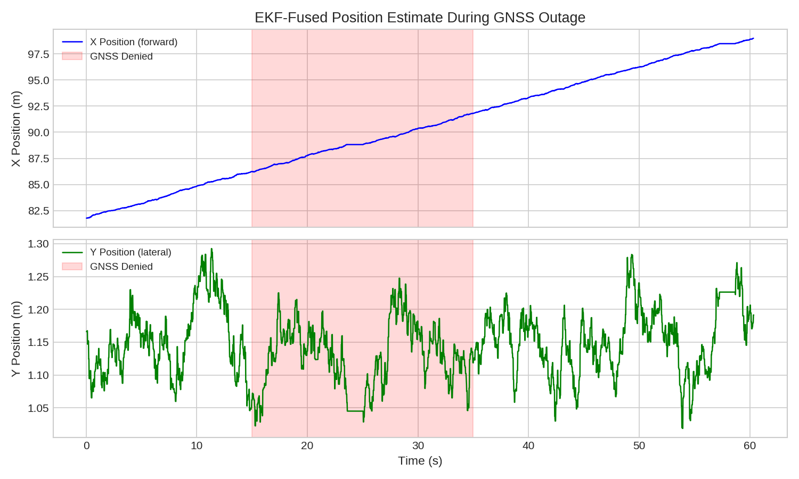
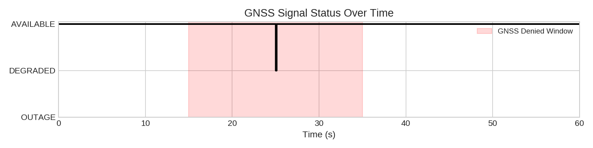
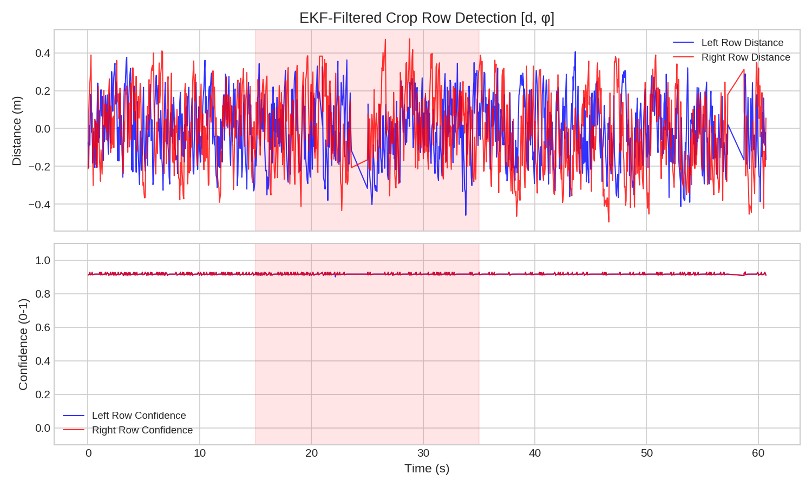
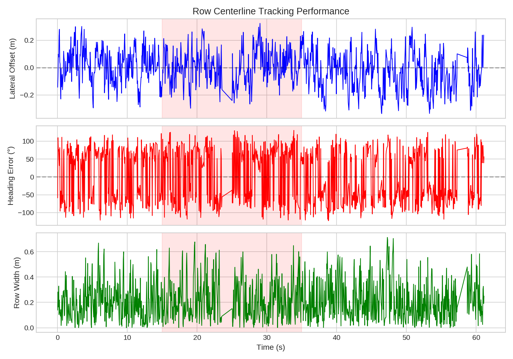

# Lane Detection & Localization — Krish Shah

## Overview

This module implements LiDAR-IMU EKF-based navigation for the autonomous agricultural tractor's under-canopy operation. It is part of the larger [Autonomous Tractor System](https://github.com/Bmerrysmith/Autonomous-tractor-system) project for CEN 4930 at FGCU.

**Three deliverables:**
1. LiDAR-IMU EKF for under-canopy row following
2. GNSS outage bridging with odometry and IMU
3. Row centerline output for lane following and path planner return target

## Architecture

```
2D LiDAR (/scan)     IMU (/imu/data)     GNSS (/gps/fix)     Odom (/odom)
      |                    |                    |                   |
      v                    v                    v                   v
┌─────────────┐    ┌──────────────┐    ┌────────────────┐
│ Row Detect  │    │ EKF Localize │    │ GNSS Bridge    │
│ K-means +   │    │ 6-state CVTR │    │ Outage detect  │
│ RANSAC + EKF│    │ sensor fusion│    │ DR management  │
└──────┬──────┘    └──────┬───────┘    └───────┬────────┘
       |                   |                    |
       v                   v                    v
    ┌──────────────────────────────────────────────┐
    │         Row Centerline + Pure Pursuit         │
    └───────────┬──────────────────┬────────────────┘
                v                  v
        /row_centerline        /cmd_vel
        (→ Anthony's MC)       (→ Vehicle Control)
```

## Files

```
lane_detection_localization/
├── scripts/
│   ├── lidar_row_detection_node.py    # Crop row detection (K-means + RANSAC + EKF)
│   ├── ekf_localization_node.py       # GNSS+IMU+Odom sensor fusion EKF
│   ├── gnss_outage_bridge_node.py     # GNSS health monitor + DR mode
│   ├── row_centerline_node.py         # Centerline + pure pursuit controller
│   ├── sim_sensor_publisher.py        # Synthetic sensor data for testing
│   └── record_and_plot.py             # Data recording + chart generation
├── launch/
│   └── undercanopy_nav.launch         # Launch all nodes
├── config/
│   └── ekf_config.yaml                # robot_localization EKF config (alternative)
├── msg/
│   ├── CropRowState.msg               # EKF-filtered row state [d, phi]
│   └── RowCenterline.msg              # Centerline + waypoint for path planner
├── results/
│   └── plots/
│       ├── position_tracking.png      # Position through GNSS outage
│       ├── gnss_status_timeline.png   # GNSS AVAILABLE/OUTAGE transitions
│       ├── crop_row_detection.png     # Row distances + confidence
│       ├── centerline_tracking.png    # Lateral offset + heading error
│       └── controller_output.png      # Pure pursuit velocity commands
├── package.xml
├── CMakeLists.txt
└── README.md
```

## Prerequisites

- Ubuntu 20.04 (WSL2 works)
- ROS Noetic
- Python 3.8+

```bash
# Install ROS Noetic (if not already installed)
sudo sh -c 'echo "deb http://packages.ros.org/ros/ubuntu focal main" > /etc/apt/sources.list.d/ros-latest.list'
curl -s https://raw.githubusercontent.com/ros/rosdistro/master/ros.asc | sudo apt-key add -
sudo apt update
sudo apt install -y ros-noetic-desktop ros-noetic-robot-localization ros-noetic-tf2-ros ros-noetic-tf
sudo apt install -y python3-catkin-tools python3-rosdep g++ cmake

# Initialize rosdep
sudo rosdep init
rosdep update

# Add ROS to shell
echo "source /opt/ros/noetic/setup.bash" >> ~/.bashrc
source ~/.bashrc
```

## Setup

```bash
# Create catkin workspace (skip if you already have one)
mkdir -p ~/catkin_ws/src
cd ~/catkin_ws/src

# Copy this folder into the workspace
cp -r /path/to/lane_detection_localization ~/catkin_ws/src/undercanopy_ekf_nav

# Build
cd ~/catkin_ws
catkin_make
echo "source ~/catkin_ws/devel/setup.bash" >> ~/.bashrc
source devel/setup.bash
```

## Running

Three terminals needed:

**Terminal 1:**
```bash
roscore
```

**Terminal 2:**
```bash
source ~/catkin_ws/devel/setup.bash
roslaunch undercanopy_ekf_nav undercanopy_nav.launch use_sim:=true
```

**Terminal 3 (monitor):**
```bash
source ~/catkin_ws/devel/setup.bash

# See all topics
rostopic list

# Watch GNSS outage (flips at ~17s)
rostopic echo /gnss/status

# Watch row detection
rostopic echo /crop_row_state

# Watch centerline
rostopic echo /row_centerline

# Generate plots (records 60s then saves PNGs)
python3 ~/catkin_ws/src/undercanopy_ekf_nav/scripts/record_and_plot.py
```

## Results

### Position Tracking Through GNSS Outage
X position continues smoothly through the 20-second GNSS-denied window (t=15s to t=35s).



### GNSS Signal Status
Automatic outage detection and recovery without manual intervention.



### Crop Row Detection Confidence
EKF-filtered row confidence stays above 0.9 even during GNSS outage (LiDAR is independent of GNSS).



### Centerline Tracking
Lateral offset bounded within ±0.3m with pure pursuit steering corrections.



## Integration Points

| Topic | Consumer | Purpose |
|-------|----------|---------|
| `/crop_row_state` | Benny's `lidar_roi_subscriber` | Row boundaries for WeedDet ROI mask (30-50% inference reduction) |
| `/row_centerline` | Anthony's `mission_controller_node` | Lane following + WEED_INTERCEPT return target |
| `/localization/pose` | Anthony's `path_planner_node` | Global pose for trajectory generation |
| `/cmd_vel` | Vehicle control | Velocity commands from pure pursuit |

## References

1. Liu et al. (2024). "LiDAR-Based Crop Row Detection for Over-Canopy Navigation." arXiv:2403.17774
2. Higuti et al. (2021). "Multi-Sensor Fusion based Robust Row Following." arXiv:2106.15029
3. Wu et al. (2024). "LIO-EKF: High Frequency LiDAR-Inertial Odometry." ICRA 2024
